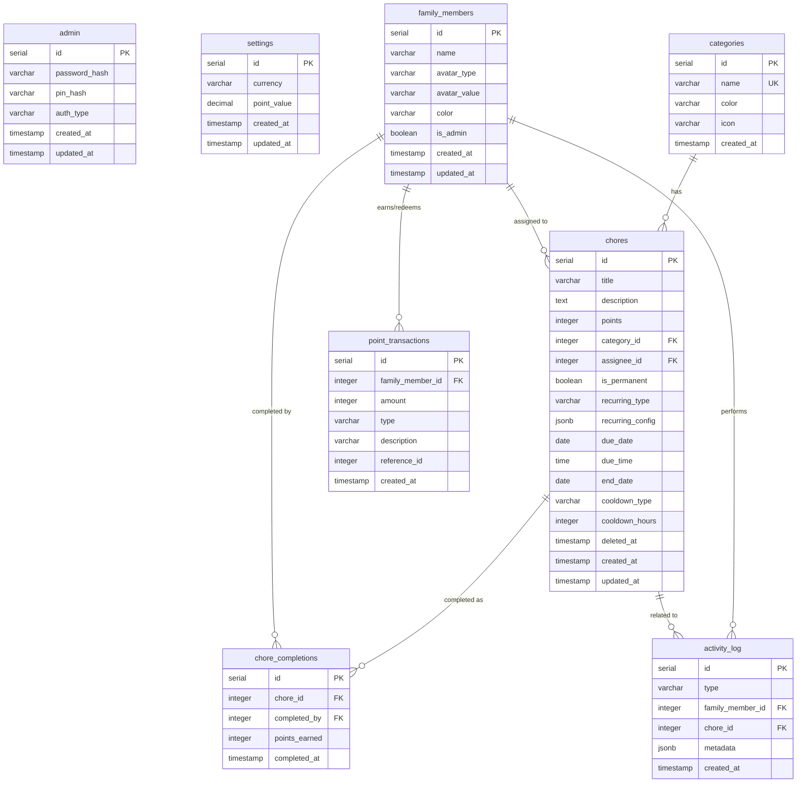

# FamilyHub — Database Schema

This document defines the PostgreSQL database schema using Drizzle ORM.

---

## Entity Relationship Diagram (Mermaid)



---

## Feature Coverage Matrix

| PLAN.md Feature | Database Support | Table(s) |
|-----------------|------------------|----------|
| Admin password/PIN | ✅ | `admin.password_hash`, `admin.pin_hash`, `admin.auth_type` |
| Currency & point value | ✅ | `settings.currency`, `settings.point_value` |
| Family members | ✅ | `family_members` |
| Avatar (DiceBear/custom) | ✅ | `family_members.avatar_type`, `family_members.avatar_value` |
| Family member color | ✅ | `family_members.color` |
| Admin flag | ✅ | `family_members.is_admin` |
| Categories | ✅ | `categories` |
| Chore title/description | ✅ | `chores.title`, `chores.description` |
| Chore points | ✅ | `chores.points` |
| Chore category | ✅ | `chores.category_id` → `categories` |
| Chore assignee | ✅ | `chores.assignee_id` → `family_members` |
| Permanent chores | ✅ | `chores.is_permanent` |
| Recurring chores | ✅ | `chores.recurring_type`, `chores.recurring_config` |
| Due date/time | ✅ | `chores.due_date`, `chores.due_time` |
| End date (auto-archive) | ✅ | `chores.end_date` |
| Cooldown (daily/hours) | ✅ | `chores.cooldown_type`, `chores.cooldown_hours` |
| Soft delete | ✅ | `chores.deleted_at` |
| Chore completions | ✅ | `chore_completions` |
| Who completed | ✅ | `chore_completions.completed_by` |
| Points earned (snapshot) | ✅ | `chore_completions.points_earned` |
| Point transactions | ✅ | `point_transactions` |
| Points earned/redeemed | ✅ | `point_transactions.amount`, `point_transactions.type` |
| Transaction history | ✅ | `point_transactions.created_at` |
| Activity log | ✅ | `activity_log` |
| Activity metadata | ✅ | `activity_log.metadata` (JSON) |

---

## Table Definitions

### `admin`

Stores the single admin account credentials.

| Column | Type | Constraints | Description |
|--------|------|-------------|-------------|
| `id` | `serial` | PRIMARY KEY | Auto-increment ID |
| `password_hash` | `varchar(255)` | NULLABLE | Bcrypt hash of password |
| `pin_hash` | `varchar(255)` | NULLABLE | Bcrypt hash of 4-digit PIN |
| `auth_type` | `varchar(20)` | NOT NULL, DEFAULT 'password' | 'password' or 'pin' |
| `created_at` | `timestamp` | NOT NULL, DEFAULT NOW() | |
| `updated_at` | `timestamp` | NOT NULL, DEFAULT NOW() | |

**Notes:**
- Only one of `password_hash` or `pin_hash` will be set based on `auth_type`
- System should only have one admin row

---

### `settings`

Global application settings.

| Column | Type | Constraints | Description |
|--------|------|-------------|-------------|
| `id` | `serial` | PRIMARY KEY | Auto-increment ID |
| `currency` | `varchar(3)` | NOT NULL, DEFAULT 'USD' | ISO 4217 currency code |
| `point_value` | `decimal(10,2)` | NOT NULL, DEFAULT 1.00 | Money value per 1 point |
| `created_at` | `timestamp` | NOT NULL, DEFAULT NOW() | |
| `updated_at` | `timestamp` | NOT NULL, DEFAULT NOW() | |

**Notes:**
- System should only have one settings row

---

### `family_members`

All family members including the admin.

| Column | Type | Constraints | Description |
|--------|------|-------------|-------------|
| `id` | `serial` | PRIMARY KEY | Auto-increment ID |
| `name` | `varchar(100)` | NOT NULL | Display name |
| `avatar_type` | `varchar(20)` | NOT NULL, DEFAULT 'dicebear' | 'dicebear' or 'custom' |
| `avatar_value` | `varchar(500)` | NOT NULL | DiceBear seed or uploaded file path |
| `color` | `varchar(7)` | NOT NULL | Hex color code (e.g., '#FFB3BA') |
| `is_admin` | `boolean` | NOT NULL, DEFAULT FALSE | TRUE for the admin user |
| `created_at` | `timestamp` | NOT NULL, DEFAULT NOW() | |
| `updated_at` | `timestamp` | NOT NULL, DEFAULT NOW() | |

**Pastel Color Palette:**
```
#FFB3BA (Pink)
#FFDFBA (Peach)
#FFFFBA (Yellow)
#BAFFC9 (Mint)
#BAE1FF (Sky Blue)
#E0BBE4 (Lavender)
#D4A5A5 (Dusty Rose)
#A5D4D4 (Teal)
#C9C9FF (Periwinkle)
#FFD4BA (Apricot)
#D4BAFF (Lilac)
#BAFFD4 (Seafoam)
```

---

### `categories`

Optional chore categories.

| Column | Type | Constraints | Description |
|--------|------|-------------|-------------|
| `id` | `serial` | PRIMARY KEY | Auto-increment ID |
| `name` | `varchar(50)` | NOT NULL, UNIQUE | Category name |
| `color` | `varchar(7)` | NULLABLE | Hex color for visual distinction |
| `icon` | `varchar(50)` | NULLABLE | Icon name (NuxtUI icon) |
| `created_at` | `timestamp` | NOT NULL, DEFAULT NOW() | |

---

### `chores`

Chore definitions (templates).

| Column | Type | Constraints | Description |
|--------|------|-------------|-------------|
| `id` | `serial` | PRIMARY KEY | Auto-increment ID |
| `title` | `varchar(200)` | NOT NULL | Chore title |
| `description` | `text` | NULLABLE | Optional description |
| `points` | `integer` | NOT NULL, DEFAULT 0 | Points awarded on completion |
| `category_id` | `integer` | NULLABLE, FK → categories | Optional category |
| `assignee_id` | `integer` | NULLABLE, FK → family_members | NULL = unassigned/anyone |
| `is_permanent` | `boolean` | NOT NULL, DEFAULT FALSE | TRUE = always visible after completion |
| `recurring_type` | `varchar(20)` | NULLABLE | 'daily', 'weekly', 'biweekly', 'custom', NULL |
| `recurring_config` | `jsonb` | NULLABLE | Recurring details (see below) |
| `due_date` | `date` | NULLABLE | For one-time or start of recurring |
| `due_time` | `time` | NULLABLE | Optional time component |
| `end_date` | `date` | NULLABLE | When recurring chore should auto-archive |
| `cooldown_type` | `varchar(20)` | NULLABLE | For permanent: 'unlimited', 'daily', 'hours' |
| `cooldown_hours` | `integer` | NULLABLE | Hours between completions (if cooldown_type='hours') |
| `deleted_at` | `timestamp` | NULLABLE | Soft delete timestamp (NULL = active) |
| `created_at` | `timestamp` | NOT NULL, DEFAULT NOW() | |
| `updated_at` | `timestamp` | NOT NULL, DEFAULT NOW() | |

**Notes:**
- All timestamps stored in UTC
- `deleted_at` used for soft-delete (one-time chores after completion, expired recurring)
- `cooldown_type`: 'unlimited' = no limit, 'daily' = once per day, 'hours' = custom cooldown

**`recurring_config` JSON Examples:**

```json
// Daily
{ "type": "daily" }

// Weekly (every Monday)
{ "type": "weekly", "dayOfWeek": 1 }

// Bi-weekly (every other Tuesday)
{ "type": "biweekly", "dayOfWeek": 2, "startDate": "2025-01-07" }

// Custom: every 3 days
{ "type": "interval", "days": 3 }

// Custom: specific days (Mon, Wed, Fri)
{ "type": "days", "daysOfWeek": [1, 3, 5] }
```

---

### `chore_completions`

Records of completed chores.

| Column | Type | Constraints | Description |
|--------|------|-------------|-------------|
| `id` | `serial` | PRIMARY KEY | Auto-increment ID |
| `chore_id` | `integer` | NOT NULL, FK → chores | Completed chore |
| `completed_by` | `integer` | NOT NULL, FK → family_members | Who completed it |
| `points_earned` | `integer` | NOT NULL, DEFAULT 0 | Points at time of completion |
| `completed_at` | `timestamp` | NOT NULL, DEFAULT NOW() | |

---

### `point_transactions`

All point movements (earned and redeemed).

| Column | Type | Constraints | Description |
|--------|------|-------------|-------------|
| `id` | `serial` | PRIMARY KEY | Auto-increment ID |
| `family_member_id` | `integer` | NOT NULL, FK → family_members | Account holder |
| `amount` | `integer` | NOT NULL | Positive = earned, Negative = redeemed |
| `type` | `varchar(20)` | NOT NULL | 'earned' or 'redeemed' |
| `description` | `varchar(200)` | NULLABLE | Context (chore name, redemption note) |
| `reference_id` | `integer` | NULLABLE | chore_completion.id if earned |
| `created_at` | `timestamp` | NOT NULL, DEFAULT NOW() | |

**Note:** Balance = SUM(amount) WHERE family_member_id = X

---

### `activity_log`

Timeline events for activity page.

| Column | Type | Constraints | Description |
|--------|------|-------------|-------------|
| `id` | `serial` | PRIMARY KEY | Auto-increment ID |
| `type` | `varchar(30)` | NOT NULL | Event type |
| `family_member_id` | `integer` | NULLABLE, FK → family_members | Related member |
| `chore_id` | `integer` | NULLABLE, FK → chores | Related chore |
| `metadata` | `jsonb` | NULLABLE | Additional event data |
| `created_at` | `timestamp` | NOT NULL, DEFAULT NOW() | |

**Event Types:**
- `chore_completed` — metadata: `{ points: 10, choreName: "..." }`
- `points_redeemed` — metadata: `{ amount: 100, moneyValue: "50.00 DKK" }`

**Index:** `(created_at DESC)` for timeline queries

---

## Drizzle Schema (TypeScript)

```typescript
// server/db/schema.ts

import { pgTable, serial, varchar, text, integer, boolean, timestamp, date, time, decimal, jsonb } from 'drizzle-orm/pg-core'

export const admin = pgTable('admin', {
  id: serial('id').primaryKey(),
  passwordHash: varchar('password_hash', { length: 255 }),
  pinHash: varchar('pin_hash', { length: 255 }),
  authType: varchar('auth_type', { length: 20 }).notNull().default('password'),
  createdAt: timestamp('created_at').notNull().defaultNow(),
  updatedAt: timestamp('updated_at').notNull().defaultNow(),
})

export const settings = pgTable('settings', {
  id: serial('id').primaryKey(),
  currency: varchar('currency', { length: 3 }).notNull().default('USD'),
  pointValue: decimal('point_value', { precision: 10, scale: 2 }).notNull().default('1.00'),
  createdAt: timestamp('created_at').notNull().defaultNow(),
  updatedAt: timestamp('updated_at').notNull().defaultNow(),
})

export const familyMembers = pgTable('family_members', {
  id: serial('id').primaryKey(),
  name: varchar('name', { length: 100 }).notNull(),
  avatarType: varchar('avatar_type', { length: 20 }).notNull().default('dicebear'),
  avatarValue: varchar('avatar_value', { length: 500 }).notNull(),
  color: varchar('color', { length: 7 }).notNull(),
  isAdmin: boolean('is_admin').notNull().default(false),
  createdAt: timestamp('created_at').notNull().defaultNow(),
  updatedAt: timestamp('updated_at').notNull().defaultNow(),
})

export const categories = pgTable('categories', {
  id: serial('id').primaryKey(),
  name: varchar('name', { length: 50 }).notNull().unique(),
  color: varchar('color', { length: 7 }),
  icon: varchar('icon', { length: 50 }),
  createdAt: timestamp('created_at').notNull().defaultNow(),
})

export const chores = pgTable('chores', {
  id: serial('id').primaryKey(),
  title: varchar('title', { length: 200 }).notNull(),
  description: text('description'),
  points: integer('points').notNull().default(0),
  categoryId: integer('category_id').references(() => categories.id, { onDelete: 'set null' }),
  assigneeId: integer('assignee_id').references(() => familyMembers.id, { onDelete: 'set null' }),
  isPermanent: boolean('is_permanent').notNull().default(false),
  recurringType: varchar('recurring_type', { length: 20 }),
  recurringConfig: jsonb('recurring_config'),
  dueDate: date('due_date'),
  dueTime: time('due_time'),
  endDate: date('end_date'),
  cooldownType: varchar('cooldown_type', { length: 20 }),
  cooldownHours: integer('cooldown_hours'),
  deletedAt: timestamp('deleted_at'),
  createdAt: timestamp('created_at').notNull().defaultNow(),
  updatedAt: timestamp('updated_at').notNull().defaultNow(),
})

export const choreCompletions = pgTable('chore_completions', {
  id: serial('id').primaryKey(),
  choreId: integer('chore_id').notNull().references(() => chores.id, { onDelete: 'cascade' }),
  completedBy: integer('completed_by').notNull().references(() => familyMembers.id, { onDelete: 'cascade' }),
  pointsEarned: integer('points_earned').notNull().default(0),
  completedAt: timestamp('completed_at').notNull().defaultNow(),
})

export const pointTransactions = pgTable('point_transactions', {
  id: serial('id').primaryKey(),
  familyMemberId: integer('family_member_id').notNull().references(() => familyMembers.id, { onDelete: 'cascade' }),
  amount: integer('amount').notNull(),
  type: varchar('type', { length: 20 }).notNull(),
  description: varchar('description', { length: 200 }),
  referenceId: integer('reference_id'),
  createdAt: timestamp('created_at').notNull().defaultNow(),
})

export const activityLog = pgTable('activity_log', {
  id: serial('id').primaryKey(),
  type: varchar('type', { length: 30 }).notNull(),
  familyMemberId: integer('family_member_id').references(() => familyMembers.id, { onDelete: 'set null' }),
  choreId: integer('chore_id').references(() => chores.id, { onDelete: 'set null' }),
  metadata: jsonb('metadata'),
  createdAt: timestamp('created_at').notNull().defaultNow(),
})
```

---

## Indexes

```sql
-- Performance indexes
CREATE INDEX idx_chores_active ON chores(deleted_at) WHERE deleted_at IS NULL;
CREATE INDEX idx_chores_due_date ON chores(due_date, deleted_at);
CREATE INDEX idx_chores_recurring ON chores(recurring_type, due_date) WHERE recurring_type IS NOT NULL;
CREATE INDEX idx_chore_completions_member ON chore_completions(completed_by, completed_at);
CREATE INDEX idx_chore_completions_cooldown ON chore_completions(chore_id, completed_at DESC);
CREATE INDEX idx_point_transactions_member ON point_transactions(family_member_id, created_at);
CREATE INDEX idx_activity_log_timeline ON activity_log(created_at DESC);
CREATE INDEX idx_activity_log_member ON activity_log(family_member_id, created_at DESC);
```

---

## Seed Data (Development)

```sql
-- No default categories - admin creates as needed
-- Categories table starts empty

-- Example test family member (for development only)
-- INSERT INTO family_members (name, avatar_type, avatar_value, color, is_admin) VALUES
--   ('Admin', 'dicebear', 'admin-seed', '#FFB3BA', TRUE);
```

---

## Timezone Handling

- All `timestamp` columns store UTC values
- Application converts to browser timezone for display
- Use `timestamptz` (timestamp with time zone) in PostgreSQL
- Drizzle config: `timestamp('column_name', { withTimezone: true })`
